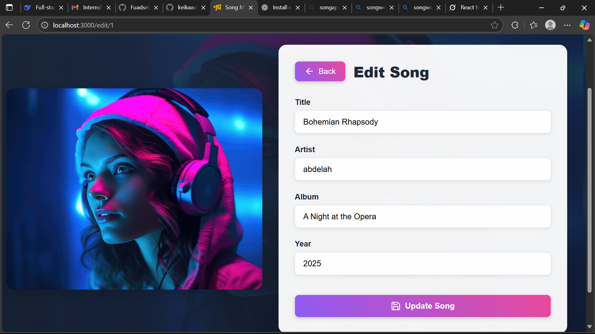
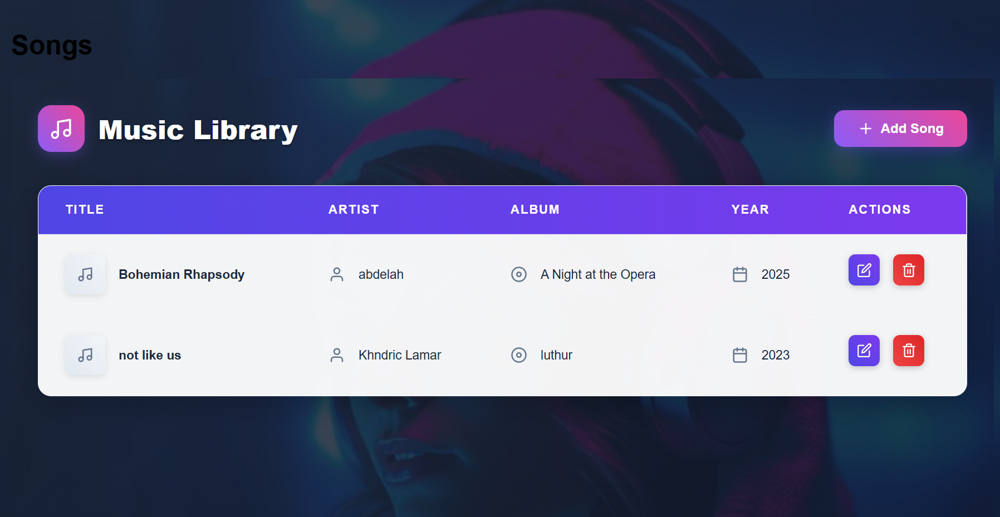

# Addis Software Song Management Application

A full-stack application with React frontend and Laravel backend for managing songs library.

## Features

### Frontend
- Paginated song list with sorting
- CRUD operations (Create, Read, Update, Delete)
- Responsive design with Emotion styling
- Redux state management with Redux-Saga
- Custom Webpack configuration

### Backend (Laravel)
- RESTful API endpoints
- Pagination support
- Validation
- CORS configuration

## API Documentation

### Endpoints

| Method | Endpoint         | Description                     |
|--------|------------------|---------------------------------|
| GET    | `/api/songs`     | Get paginated list of songs     |
| POST   | `/api/songs`     | Create a new song               |
| PUT    | `/api/songs/{id}`| Update an existing song         |
| DELETE | `/api/songs/{id}`| Delete a song                   |

### Request/Response Examples

**Get Songs (Paginated)**
```json
GET /api/songs?page=1

Response:
{
  "data": [
    {
      "id": 1,
      "title": "Song Title",
      "artist": "Artist Name",
      "album": "Album Name", 
      "year": 2022
    }
  ],
  "current_page": 1,
  "last_page": 5,
  "total": 50
}
```

## Features
- **Frontend**: React with Redux, Emotion styling, pagination
- **Backend**: Laravel REST API with CRUD operations
- **Build**: Custom Webpack configuration
- **Performance**: Code splitting and lazy loading

## Backend Setup (Laravel)

### Prerequisites
- PHP 8.0+
- Composer
- MySQL

### Installation
```bash
git clone [your-repo-url]
cd backend
composer install
cp .env.example .env
php artisan key:generate
php artisan migrate
php artisan serve
```
# Webpack Configuration

The application uses a custom Webpack configuration with the following features:

- **Babel loader** for JS/JSX files
- **CSS and style loaders** for styling
- **File loader** for images and assets
- **Environment variables** support
- **HTML template generation**
- **Development server** with hot reload

## Configuration Details

```javascript
const path = require("path");
const HtmlWebpackPlugin = require("html-webpack-plugin");
const Dotenv = require("dotenv-webpack");

module.exports = (env) => {
  return {
    entry: "./src/index.js",
    output: {
      path: path.resolve(__dirname, "dist"),
      filename: "bundle.js",
      publicPath: "/",
    },
    module: {
      rules: [
        {
          test: /\.(js|jsx)$/,
          exclude: /node_modules/,
          use: {
            loader: "babel-loader",
            options: {
              presets: ["@babel/preset-env", "@babel/preset-react"],
            },
          },
        },
        {
          test: /\.css$/,
          use: ["style-loader", "css-loader"],
        },
        {
          test: /\.(png|jpe?g|gif|svg)$/i,
          use: [
            {
              loader: "file-loader",
              options: {
                name: "[name].[ext]",
                outputPath: "images/",
              },
            },
          ],
        },
      ],
    },
    plugins: [
      new HtmlWebpackPlugin({
        template: "./public/index.html",
      }),
      new Dotenv({
        path: `./.env.${env.NODE_ENV || "development"}`,
      }),
    ],
    devServer: {
      historyApiFallback: true,
      port: 3000,
      hot: true,
    },
    resolve: {
      extensions: [".js", ".jsx"],
    },
  };
};


```
## Application Views

| Song List | Add Form | Edit Form |
|-----------|----------|-----------|
|  |  |  |
# AI Usage Policy

## AI-Assisted Development
The following parts of the project were developed with AI assistance:
- **Frontend Styling**: 
  - 100% of CSS and component styling was generated using ChatGPT
  - Emotion styling and theme configurations 
- **i Have got a little help in these area  i was learning some patterns State Management**:
  - Debugging assistance with Redux state updates
  - Redux-Saga implementation patterns
  - Verified through Redux DevTools and application testing
i Have got some help in these areas when i got errors but core functinality ai free 
- **Webpack Configuration**:
  - Initial setup and loader configurations assisted by AI
  - Environment variable setup guidance
  - Custom rules for file handling
  - Verified by successful builds and production deployment
- **Backend (Laravel)**:
  - Action and reducer structure suggestions
  - 100% manually coded PHP implementation
  - Database migrations and Eloquent models
  - API endpoint controllers and routing
- **Core Business Logic**:
  - Application architecture decisions
  - Data flow and component structure
  - Pagination and state management logic
# Testing & Debugging
## API Testing
- **Tools Used**: Postman
- **Coverage**:
  - Tested all CRUD endpoints
  - Verified status codes (200, 201, 400, 404, etc.)
  - Validated request/response formats
  - Tested error cases and edge conditions

## Frontend Debugging
- **Primary Tools**:
  - `console.log` for state inspection
  - React Developer Tools for component hierarchy
  - Redux DevTools for state management
  - Network tab for API call monitoring
- **Debugging Process**:
  1. Reproduce the issue
  2. Isolate the component
  3. Check Redux state and actions
  4. Verify API responses
  5. Fix and regression test
## Testing Approach
1. **API-First Development**:
   - Backend developed and tested before frontend integration
   - Postman collection created for all endpoints
   - Documentation-first approach
2. **Postman Tests**:
   - Automated test scripts for critical paths
   - Environment variables for different configurations
   - Test cases for success and failure scenarios
3. **Manual UI Testing**:
   - Cross-browser testing (Chrome, Firefox, Safari)
   - Mobile responsiveness checks
   - User flow validation
   - Form submission and validation testing
This README covers all the aspects you requested including:
- API documentation and testing
- Backend installation instructions
- Webpack configuration details
- AI usage policy with clear declarations
- Testing and debugging approach

